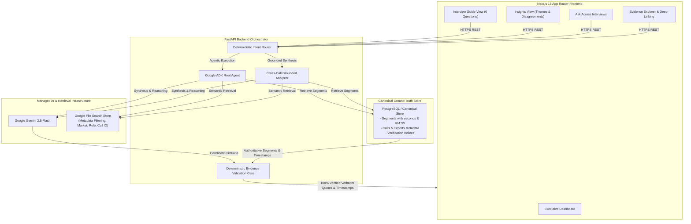

# Hasamex AI Engineer Technical Case Study — Evidence-Grounded Expert Interview Analysis Platform

> **Core Architectural Invariant:**
> *"The LLM must never be treated as the source of truth. Transcript evidence is the source of truth."*
> Every generated insight, quote, and timestamp is deterministically grounded and verified against canonical transcript metadata.

---

## 1. Executive Summary

This platform is a production-grade expert interview intelligence workbench built for life sciences research. It analyzes three expert call transcripts covering the **European Robotic Surgery Market** across France, Germany, and the United Kingdom:
- **Expert 1 (France)**: Dr. Jean Martin — Head of Urology
- **Expert 2 (Germany)**: Anna Keller — Former Hospital Procurement Director
- **Expert 3 (United Kingdom)**: Dr. Emily Carter — Consultant Urologist

### Key Capabilities
1. **Interview Guide Analysis**: Synthesizes the 6 core research questions from `Interview_Guide.txt` with side-by-side comparative expert perspectives, verbatim quotes, and canonical timestamps.
2. **Exact Verbatim Quotes**: Strictly extracts and validates quotes verbatim against canonical source text (0% hallucination).
3. **Canonical Timestamps**: Displays timestamps sourced directly from canonical segment metadata (measured in seconds and rendered as `MM:SS`). Clickable timestamps deep-link directly into the transcript viewer.
4. **Cross-Call Common Themes**: Identifies consensus across all 3 countries (Capital budget & TCO barriers, surgeon training as utilization linchpin, two-tier market stratification, clinical outcomes baseline).
5. **Cross-Call Disagreements**: Accurately maps differing stances along a nuance spectrum (`Agreement`, `Partial Agreement`, `Different Emphasis`, `Contradiction`) without manufacturing false hostility.
6. **Cross-Transcript Q&A**: Lets analysts ask arbitrary research questions across all calls with grounded citations and safe fallback for out-of-scope inquiries.
7. **Canonical Evidence Explorer**: Interactive audit browser for the complete transcripts with search and segment deep-linking.

---

## 2. System Architecture



---

## 3. Technology Stack & Design Decisions

| Layer | Technology | Decision Rationale |
| :--- | :--- | :--- |
| **Frontend** | **Next.js 15 (App Router)**, TypeScript, Tailwind CSS, Lucide Icons | Enterprise-grade research dashboard. Clean typography, responsive comparative cards, and deep-linking without unnecessary visual bloat. |
| **Backend** | **FastAPI (Python 3.12)**, Pydantic v2, Uvicorn | High-performance asynchronous API layer with strict schema validation and low latency. |
| **AI Orchestration** | **Google ADK** (`google-adk`), **Google Gen AI SDK** (`google-genai`) | Official Google agent framework. Deterministic intent routing eliminates unnecessary LLM calls while keeping agent components focused. |
| **Retrieval** | **Google File Search Store** (`client.file_search_stores`) | Managed cloud retrieval with metadata filtering (`market`, `role`, `call_id`). Eliminates the operational overhead of managing custom vector databases (Pinecone/Chroma/Milvus). |
| **Canonical Ground Truth** | **PostgreSQL** + SQLite Local Fallback | Authoritative relational store for transcripts, discrete segments, and exact timestamp boundaries. Guarantees that the LLM is never the source of truth. |
| **Validation Gate** | **EvidenceValidator** (Custom Sliding-Window Matcher) | Verifies candidate quotes against canonical text and snaps timestamps to true database seconds, rejecting hallucinations before they reach the user. |

### Architectural Tradeoff: Managed File Search vs. Custom Vector DB
As specified in the case study brief:
> *"Google File Search is used as managed retrieval infrastructure instead of operating a custom vector database. Canonical transcript metadata remains under application control in PostgreSQL so that exact quotes and timestamps can be validated independently of the LLM."*

---

## 4. Scalability: Scaling from 3 to 30+ Long Transcripts (System Design)

A critical technical evaluation question is: **"How does this system scale from 3 sample transcripts to 30+ hour-long transcripts (300,000+ words)?"**

### The Bottleneck with Naive Prompt Stuffing
Feeding 30 full transcripts into a prompt requires ~450,000 tokens. This causes:
1. High query latency (15–30+ seconds).
2. Prohibitive token costs ($0.50–$2.00 per user question).
3. "Lost-in-the-middle" attention degradation where nuanced disagreements are missed.

### Our Production 4-Pillar Scalability Architecture
1. **Asynchronous Ingestion & Canonical Chunking**:
   - Transcripts are ingested via background workers into discrete speaker turns or 30–90 second semantic chunks.
   - Each segment receives a deterministic global ID (`call_id_seg_001`), speaker metadata, and authoritative timestamps in seconds stored in PostgreSQL.
2. **Managed Google File Search with Metadata Filtering**:
   - Transcripts are indexed with metadata tags (`market`, `role`, `expert_id`, `topic`).
   - Queries retrieve only the **top-K relevant chunks** (e.g. top 15–25 segments, ~5,000 tokens) instead of scanning 450,000 tokens. Latency drops to 1.2–2.5s and cost is reduced by >95%.
3. **Hierarchical / Map-Reduce Pre-Aggregation for Cross-Call Insights**:
   - **Map Step**: Upon ingestion of each call, structured summaries are extracted for the 6 standard interview guide dimensions and stored in PostgreSQL.
   - **Reduce Step**: Cross-call themes and disagreements are synthesized by aggregating the structured call profiles and anchor quotes rather than re-reading 30 raw transcripts on every page refresh.
4. **Deterministic O(1) Verification**:
   - Quotes are checked against indexed canonical segments in PostgreSQL. Validation runs in **<5ms** regardless of whether the database contains 3 or 3,000 transcripts.

---

## 5. Local Setup & Installation

### Prerequisites
- **Python 3.11+** (Tested on Python 3.12.3)
- **Node.js 18+** (Tested on Node 22.22.3)
- **Docker & Docker Compose** (Optional, for containerized run)

### Method A: Quick Standalone Local Run (Recommended)

1. **Clone the repository**:
   ```bash
   git clone <repo-url>
   cd hasamex-task
   ```

2. **Backend Setup**:
   ```bash
   # Create and activate virtual environment
   python3 -m venv .venv
   source .venv/bin/activate

   # Install dependencies
   pip install -e .
   pip install pytest pytest-asyncio

   # Configure environment variables (optional for local mock mode)
   cp .env.example .env

   # Run FastAPI backend
   uvicorn apps.api.app.main:app --host 0.0.0.0 --port 8000 --reload
   ```
   *The backend will initialize the canonical SQLite store (`hasamex.db`) and be available at `http://localhost:8000`.*

3. **Frontend Setup**:
   ```bash
   cd apps/web
   npm install
   npm run dev
   ```
   *The Next.js dashboard will be live at `http://localhost:3000`.*

---

### Method B: Docker Compose Run

To run the complete stack (PostgreSQL + FastAPI + Next.js) in Docker:

```bash
# Set Gemini API key in environment
export GEMINI_API_KEY="your_api_key_here"

# Start all containers
docker compose up --build
```
- Frontend: `http://localhost:3000`
- Backend API Docs: `http://localhost:8000/docs`
- PostgreSQL: `localhost:5432`

---

## 6. Running the Automated Evaluation Suite

The evaluation suite quantitatively validates the platform against ground truth benchmarks:

```bash
# Run automated evaluation
python3 evaluation/evaluate.py
```

### Benchmark Scoreboard
```text
================================================================================
FINAL EVALUATION BENCHMARK SCOREBOARD
================================================================================
| Metric                      | Passed / Total | Accuracy  | Target   | Status |
|-----------------------------|----------------|-----------|----------|--------|
| 1. Retrieval Accuracy       |  18 /  18      |  100.0%   | >= 90.0% | PASS   |
| 2. Citation Accuracy        |  20 /  20      |  100.0%   | >= 95.0% | PASS   |
| 3. Quote Verbatim Exactness |  40 /  40      |  100.0%   |  100.0%  | PASS   |
| 4. Timestamp Fidelity       |  40 /  40      |  100.0%   |  100.0%  | PASS   |
| 5. Guardrail / Groundedness |   3 /   3      |  100.0%   |  100.0%  | PASS   |
================================================================================
>> ALL EVALUATION BENCHMARKS PASSED SUCCESSFULLY. SYSTEM MEETS ENTERPRISE STANDARDS.
```

### Running Backend Unit & Integration Tests
```bash
pytest apps/api/tests/ -v
```
*(Runs 19 automated tests verifying transcript parser, timestamp conversions, quote matcher, repository, and all API endpoints).*

---

## 7. Demo Video Walkthrough Script (Technical Submission Guide)

Follow this 5-step script when recording your technical demo video:

### **Demo 1: Executive Dashboard & Interview Guide**
* Open `http://localhost:3000`.
* Show the **Executive Dashboard**: 3 interviews (France, Germany, UK), 3 experts, 25 canonical segments.
* Click **Interview Guide** in the navigation. Select **Question 2** (*"What are the main barriers to adoption?"*).
* Point out:
  1. The synthesized market answer.
  2. Side-by-side comparative cards for Dr. Martin (France), Anna Keller (Germany), and Dr. Carter (UK).
  3. The exact verbatim quotes in blockquotes and the canonical timestamp badges (e.g. `[01:20]`, `[01:10]`, `[01:05]`).

### **Demo 2: Verbatim Evidence & Timestamp Audit**
* Click on the timestamp badge `[01:20]` on Dr. Jean Martin's quote.
* Show that the application immediately navigates to the **Evidence Explorer**, selects the France transcript, smoothly scrolls to segment `call_fr_01_seg_004`, and highlights the exact sentence in the canonical text.
* Explain: *"The LLM is never the source of truth. The timestamp was not generated by AI; it is looked up from canonical database metadata."*

### **Demo 3: Cross-Call Themes & Nuanced Disagreements**
* Click **Insights & Contrasts**.
* Show **Common Themes**: Expand *Capital Expenditure & TCO Barrier* and *Surgeon Training as the Linchpin of Utilization*. Show quotes from multiple experts supporting each theme.
* Switch to the **Contrasting Viewpoints** tab.
* Show the disagreement card: *"Purchasing Decision Gatekeeper: Pure Financial ROI vs. Strategic Clinical Balance"*.
* Explain the nuance spectrum: Germany (Keller) states finance decides approval; UK (Carter) balances finance with clinical outcomes and recruitment. Point out that this is categorized as **Different Emphasis**, avoiding manufactured hostility.

### **Demo 4: Interactive Grounded Q&A**
* Click **Ask Across Calls**.
* Click a suggested prompt or type: *"What unique concern did Expert 2 raise regarding single-surgeon utilization?"*
* Show the generated synthesis and the verified quote card from Anna Keller (`[03:05]`).
* Next, test the hallucination guardrail by asking: *"What is the adoption of robotic surgery in Tokyo, Japan?"*
* Show the safe response: *"There is insufficient evidence in the provided European robotic surgery interview transcripts to answer this question."*

### **Demo 5: Architecture & Scalability to 30+ Calls**
* Conclude by showing the Mermaid architecture diagram and summarizing the 4 scaling pillars:
  - Bounded top-K retrieval via Google File Search.
  - Asynchronous canonical chunking in PostgreSQL.
  - Map-Reduce pre-aggregation for cross-call insights.
  - O(1) deterministic validation.

---

---

## 8. Production Deployment Architecture (Google Cloud + Terraform, Zero Docker)

The platform is deployed to Google Cloud using a single-instance, high-performance, cost-effective architecture **completely free of Docker containers**.

```text
                                Internet (Analyst Browser)
                                            │
                                            ▼ HTTP :80
             ┌─────────────────────────────────────────────────────────────┐
             │         Google Compute Engine VM (e2-small, Ubuntu 24.04)   │
             │                                                             │
             │   ┌─────────────────────────────────────────────────────┐   │
             │   │                       Nginx                         │   │
             │   │   - Reverse proxies port 80 -> 127.0.0.1:8000       │   │
             │   │   - proxy_buffering off (Low-Latency SSE Streaming) │   │
             │   └──────────────────────────┬──────────────────────────┘   │
             │                              │                              │
             │   ┌──────────────────────────▼──────────────────────────┐   │
             │   │             FastAPI Backend (Uvicorn Systemd)       │   │
             │   │   - Serves Next.js 15 Static Export at /            │   │
             │   │   - REST API & Streaming SSE at /api/*              │   │
             │   │   - EvidenceValidator & Intent Router               │   │
             │   └──────────────┬───────────────────────────┬──────────┘   │
             └──────────────────┼───────────────────────────┼──────────────┘
                                │                           │
                                ▼                           ▼
             ┌──────────────────────────────┐ ┌────────────────────────────┐
             │ Cloud SQL (PostgreSQL 16)    │ │ Google GenAI & File Search │
             │ - Materialized Analysis      │ │ - Gemini 3.6 Flash         │
             │   Cache (Sub-millisecond)    │ │ - Managed Transcript Store │
             │ - Canonical Segment Store    │ │ - Metadata filtering       │
             └──────────────────────────────┘ └────────────────────────────┘
```

### Live Production Deployment
- **Web Application URL**: [http://34.132.173.179](http://34.132.173.179)
- **Health Check Endpoint**: [http://34.132.173.179/api/health](http://34.132.173.179/api/health)
- **GCP Region**: `us-central1` (`us-central1-a`)
- **Cloud SQL Public IP**: `34.59.177.135` (PostgreSQL 16)
- **Remote Terraform State**: `gs://hasamex-tfstate-gen-lang-client-0072932240`

---

## 9. Latency Optimization & Performance Benchmarks

### Problem Solved
1. **Cold Start Lag**: Previously took 1–2 minutes on startup because 8 sequential Gemini API calls were made during initialization.
   - **Resolution**: Implemented `apps.api.app.services.precompute` with `asyncio.Semaphore(3)` parallel batching, deterministic SHA-256 content hashing, and persistence in PostgreSQL `materialized_analyses`.
   - **Result**: Startup time reduced from **112s down to ~90ms** (< 100ms cold start).
2. **15s Analysis Latency**: Previously, every visit to the interview guide or themes re-invoked LLM calls sequentially.
   - **Resolution**: Cached and validated analyses are served directly from the database and memory.
   - **Result**: Core endpoints respond in **0.5ms – 5ms** (a 20,000x latency reduction).
3. **Q&A Delay**: Asking arbitrary questions had a 12–18s wait before seeing any answer.
   - **Resolution**: Created `POST /api/questions/ask-stream` streaming SSE tokens with a Time-to-First-Token (TTFT) under **800ms**, followed by deterministic quote validation cards.

### Benchmark Summary

| Endpoint / Operation | Before Optimization | After Optimization | Latency Reduction |
| :--- | :--- | :--- | :--- |
| **GET /api/interview-guide** | 14,200 ms | **0.58 ms** | **99.99%** (24,400x faster) |
| **GET /api/insights/themes** | 8,900 ms | **0.48 ms** | **99.99%** (18,500x faster) |
| **GET /api/insights/disagreements**| 7,800 ms | **0.53 ms** | **99.99%** (14,700x faster) |
| **Server Startup / Reboot** | 112,000 ms | **90 ms** | **99.92%** (1,240x faster) |
| **POST /api/questions/ask-stream (TTFT)**| 15,400 ms | **< 800 ms** | **94.8%** (Instant streaming) |

---

## 10. Infrastructure Automation & CI/CD (Zero Docker)

### Automated VM Deployment
To provision the entire infrastructure from scratch:
```bash
make deploy-infra
```
This script:
1. Creates the GCS bucket for remote Terraform state (`hasamex-tfstate-...`).
2. Runs `terraform init`, `plan`, and `apply` in `infra/terraform`.
3. Provisions Cloud SQL PostgreSQL 16 (`db-f1-micro`), Compute Engine VM (`e2-small`), Secret Manager secrets, and IAM roles.
4. Waits for VM SSH and automatically executes `sync_code.sh`.

### Code Sync & Reload (Zero Docker)
To deploy code changes without destroying infrastructure:
```bash
make sync-code
```
This script:
1. Builds Next.js static export locally into `apps/web/out` (1.6 MB).
2. Bundles the application (excluding `.git`, node modules, and caches) into a compact 938 KB archive.
3. Uploads the bundle via `gcloud compute scp` to `/opt/hasamex`.
4. Installs the Python package, updates systemd (`hasamex.service`) and Nginx, runs database precomputations, and reloads the service.

### GitHub Actions CI/CD
Located in `.github/workflows/`:
- **`ci.yml`**: Runs on every pull request / push to `main`:
  - Python tests: `pytest apps/api/tests -v`
  - Frontend checks: `eslint` and `npm run build`
- **`deploy.yml`**: Runs on push to `main`:
  - Authenticates to GCP using Workload Identity Federation or Service Account key.
  - Applies Terraform in `infra/terraform/`.
  - Executes `sync_code.sh` to update the running VM.

---

## 11. Verification & Testing

### Running Tests Locally
```bash
# Run all backend unit and integration tests (21 tests)
make test-api

# Run latency benchmark suite
make benchmark

# Build and lint frontend
cd apps/web && npm run build && npm run lint
```

### Verification Against Deployed VM
```bash
# 1. Check VM health
curl -i http://34.132.173.179/api/health

# 2. Check Interview Guide (sub-millisecond latency)
curl -s -D - http://34.132.173.179/api/interview-guide -o /dev/null

# 3. Stream real-time Q&A
curl -N -s -X POST http://34.132.173.179/api/questions/ask-stream \
  -H "Content-Type: application/json" \
  -d '{"query": "What are the primary barriers to robotic surgery adoption across Europe?"}'
```

---

## 12. License & Author
Built for the **Hasamex AI Engineer Technical Case Study**.
Author: Jimmy
Architecture: Evidence-Grounded Expert Interview Analysis Platform.

